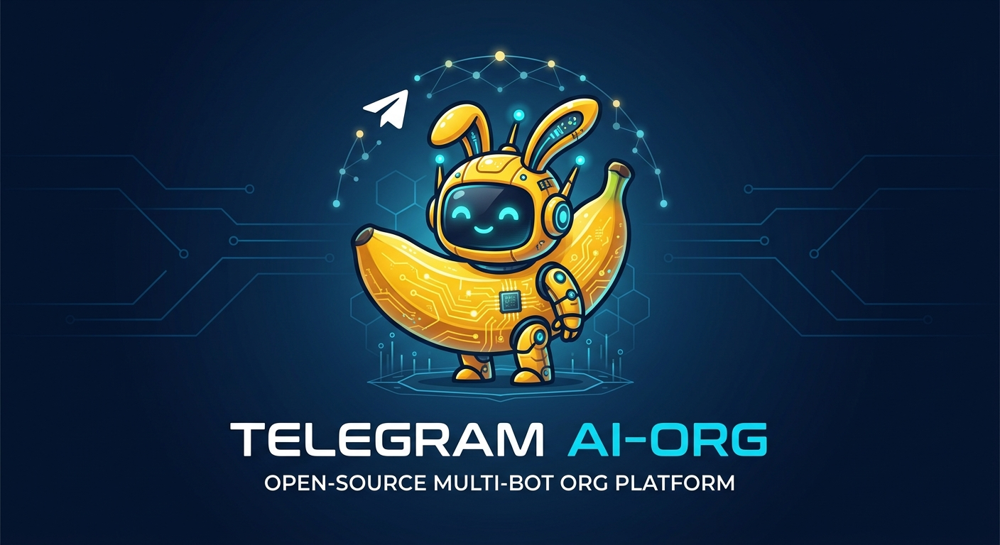
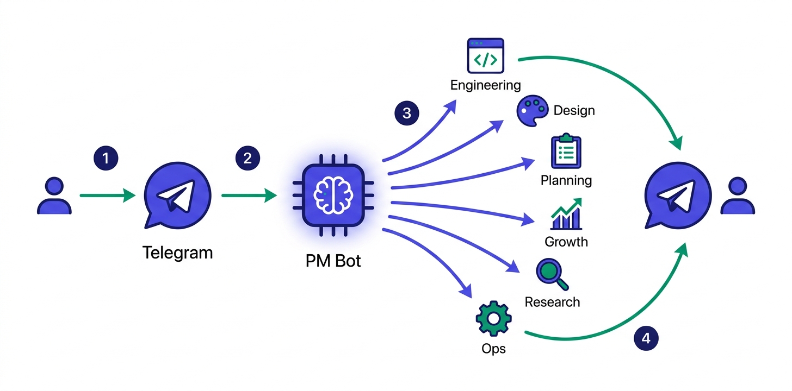
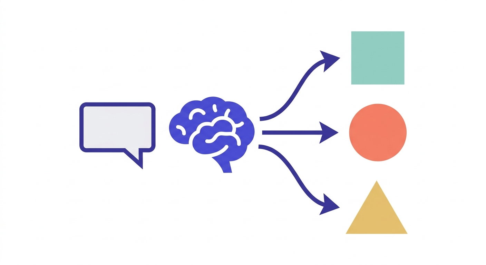
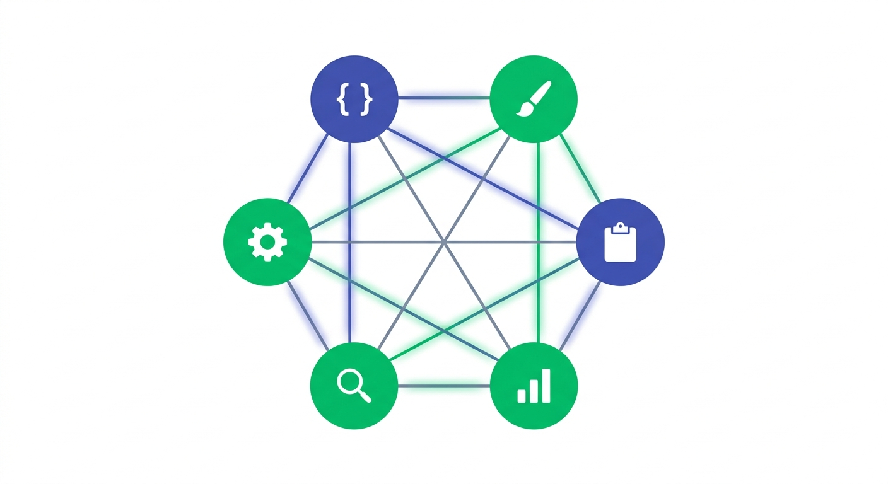
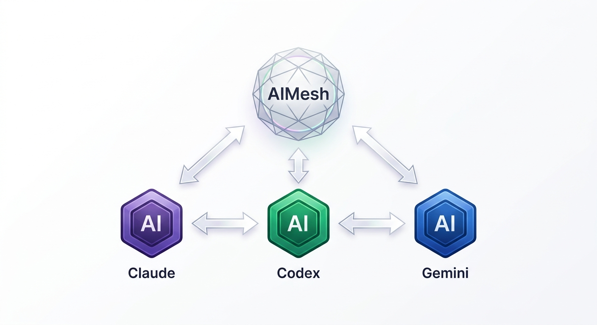
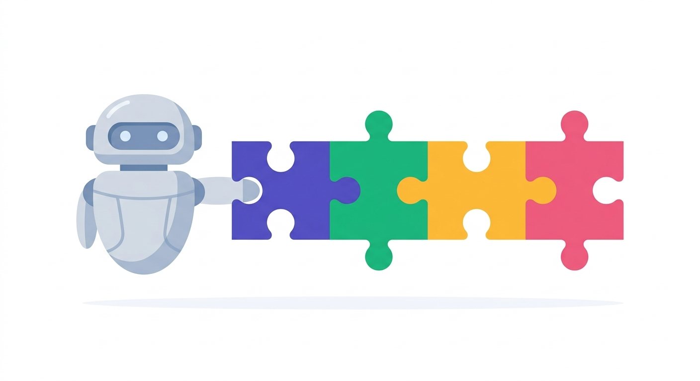
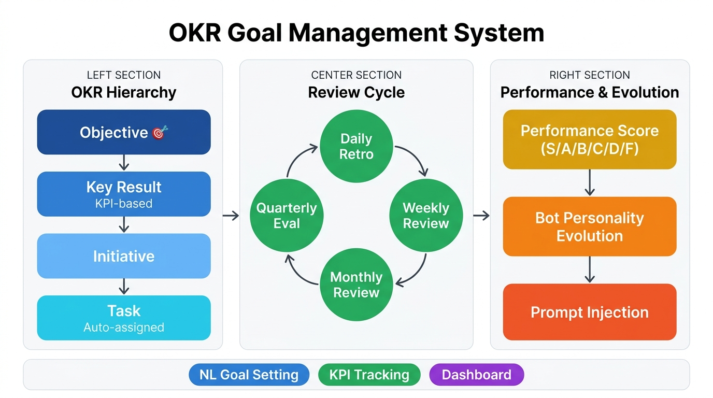
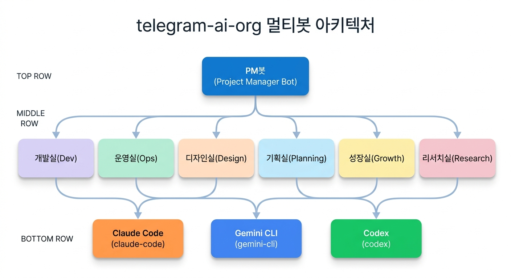
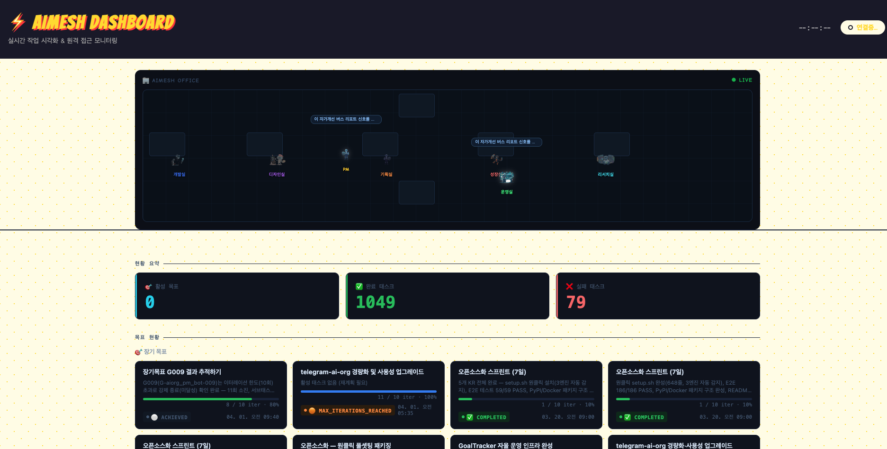
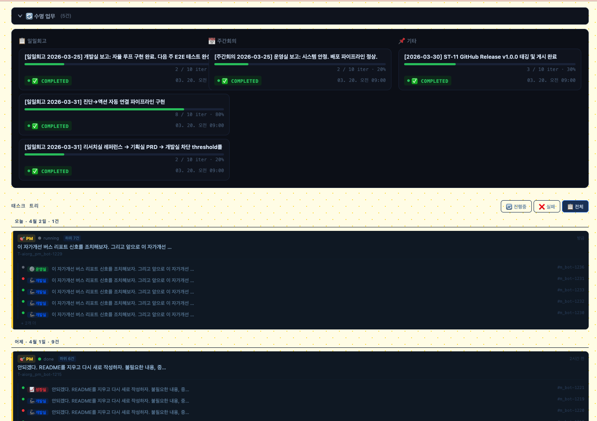

<p align="center">
  
</p>

<h1 align="center">AIMesh</h1>
<p align="center"><sub>telegram-ai-org</sub></p>

<p align="center">
  <strong>텔레그램 채팅방 하나가 AI 팀이 됩니다</strong><br/>
  <sub>Your Telegram group chat, reimagined as an AI-powered organization</sub>
</p>

<p align="center">
  <a href="https://github.com/dragon1086/aimesh/actions/workflows/ci-lint.yml">
    
  </a>
  <a href="LICENSE">
    
  </a>
  <a href="https://pypi.org/project/telegram-ai-org/">
    
  </a>
  <a href="https://hub.docker.com/r/dragon1086/aimesh">
    
  </a>
  
</p>

<br/>

---

## 이게 뭔가요? (30초 설명)

> **메시지 하나 보내면, AI 팀이 알아서 처리합니다.**

지금까지 코딩 에이전트(Claude Code, Codex, Gemini CLI)는 **혼자** 쓰는 도구였습니다.
**AIMesh**는 이 에이전트들을 **하나의 회사처럼 묶습니다.**

각 부서 봇은 태스크를 받으면 **180개 이상의 전문 에이전트 풀**에서
필요한 인재를 골라 즉석에서 팀을 꾸립니다 — 코드 리뷰어, 보안 전문가, 테스트 엔지니어 등
**상황에 맞는 전문가 조합**이 매번 달라집니다.

채팅방에 *"오늘 마케팅 전략 짜줘"* 라고 입력하면:

1. **PM 봇**이 요청을 이해하고 적절한 팀에 위임
2. **기획실 봇**이 요구사항을 정리하고
3. **성장실 봇**이 마케팅 전략을 작성
4. 결과를 채팅방에 바로 돌려줌

<p align="center">
  
</p>

설치에서 첫 응답까지 **5분**. 코딩 지식 없이도 시작 가능합니다.

---

## ✨ 주요 기능

| | 기능 | 설명 |
|---|---|---|
| 🧠 | **스마트 라우팅** | PM 봇이 메시지 의도를 파악해 최적의 부서에 자동 위임<br/> |
| 🤝 | **멀티봇 협업** | 개발·디자인·기획·성장·리서치·운영 6개 부서 봇이 유기적으로 협력<br/> |
| ⚡ | **3종 AI 엔진 지원** | Claude Code · OpenAI Codex · Gemini CLI — 부서별 최적 엔진 자동 배정<br/> |
| 🔌 | **스킬 플러그인 시스템** | 봇에 능력을 추가하는 스킬을 직접 만들고 붙일 수 있음<br/> |
| 🎯 | **OKR 목표 관리** | Objective→KR→Initiative→Task 4계층 OKR · 자연어로 목표 설정 · 일일회고/주간점검/월간리뷰/분기평가 자동 사이클 · KPI 기반 진척률 · 성과평가→봇 성격 진화 연동<br/> |
| 📊 | **실시간 대시보드** | 봇 상태·메시지 흐름·응답 이력을 웹 UI로 한눈에 모니터링 |
| 🧩 | **자유로운 조직 구성** | 부서 봇을 추가/삭제해 나만의 AI 조직 구조를 설계 |
| 🐳 | **Docker 원클릭 실행** | `docker compose up -d` 한 줄로 전체 시스템 기동 |
| 🔒 | **독립 메모리** | 봇마다 독립 컨텍스트를 유지해 일관된 성격과 맥락 보존 |

---

## 🚀 Quick Start — 5분이면 충분합니다

### 준비물

- Python 3.10 이상 (또는 Docker)
- [Telegram](https://telegram.org/) 계정 + [@BotFather](https://t.me/BotFather)에서 만든 봇 토큰
- AI 엔진 중 하나 이상: Claude Code / Codex / Gemini CLI
  > 부서별 최적 엔진이 자동 배정됩니다. 수동 선택 불필요.

### 1. 저장소 클론

```bash
git clone https://github.com/dragon1086/aimesh.git
cd aimesh
```

### 2. 원클릭 설치

```bash
bash quickstart.sh
```

화면 안내에 따라 봇 토큰과 Chat ID를 입력하면 나머지는 자동 설정됩니다.

### 3. 환경변수 확인 (선택)

`.env` 파일이 자동 생성됩니다. 필요한 경우 직접 수정하세요.

```dotenv
# 필수
TELEGRAM_PM_BOT_TOKEN=123456:ABC...
TELEGRAM_CHAT_ID=-100123456789

# AI 엔진 (설치된 엔진 경로 확인)
CLAUDE_CODE_PATH=/usr/local/bin/claude   # Claude Code
CODEX_CLI_PATH=/usr/local/bin/codex      # OpenAI Codex
GEMINI_CLI_PATH=/opt/homebrew/bin/gemini # Gemini CLI
```

> 전체 환경변수 목록 → [`.env.example`](.env.example)

### 4. 봇 실행

```bash
bash scripts/start_all.sh
```

### 5. 텔레그램에서 테스트

텔레그램 채팅방에 아무 메시지나 보내보세요!

```
안녕, 오늘 할 일 정리해줘
```

PM 봇이 요청을 받아 적절한 팀에 자동으로 위임합니다.

### 엔진 커스텀 설정 (선택)

부서별 AI 엔진은 `organizations.yaml`에서 변경할 수 있습니다:

```yaml
# organizations.yaml — 개발실 예시
- id: aiorg_engineering_bot
  execution:
    preferred_engine: codex        # 주 엔진
    fallback_engine: claude-code   # 장애 시 대체 엔진
```

| 설정 | 위치 | 설명 |
|------|------|------|
| 부서별 엔진 변경 | `organizations.yaml` → `execution.preferred_engine` | `claude-code`, `codex`, `gemini-cli` 중 선택 |
| 폴백 엔진 설정 | `organizations.yaml` → `execution.fallback_engine` | 주 엔진 장애 시 자동 전환 |
| 부서 추가/삭제 | `organizations.yaml` → `organizations` 배열 | 새 봇 정의 추가 또는 `enabled: false` |
| 조직 운영 전략 | `orchestration.yaml` | 라우팅 규칙, 글로벌 지침, 스킬 설정 |

---

## 🏗️ 아키텍처

<p align="center">
  
</p>

**흐름 요약:**
- 모든 메시지는 **PM 봇**이 가장 먼저 수신 → 의도 파악 → 적합한 부서에 위임
- 각 부서 봇은 전문 AI 엔진(Claude Code / Codex / Gemini CLI)을 실행
- 모든 대화는 DB에 저장되어 문맥이 누적됨

---

## 📊 실시간 대시보드

봇 상태, 메시지 라우팅, 응답 이력을 **한 화면**에서 확인할 수 있습니다.

<p align="center">
  
</p>

<p align="center">
  
</p>

**대시보드에서 볼 수 있는 것:**

- **봇 상태** — 각 봇의 온라인/오프라인/작업중 상태 실시간 확인
- **메시지 흐름** — PM → 각 부서 봇으로의 라우팅 경로 시각화
- **응답 이력** — 시간순 대화 로그 및 처리 시간
- **알림 현황** — 에러·지연·이상 감지 시 즉각 알림

**대시보드 실행:**

```bash
python dashboard.py
# 브라우저에서 http://localhost:8080 접속
```

---

## 🤖 부서별 봇 구성

| 봇 | 역할 | 주 엔진 | 폴백 엔진 |
|----|------|---------|----------|
| 🧠 `aiorg_pm_bot` | 전체 조율, 라우팅 | Claude Code | Gemini CLI |
| 💻 `aiorg_engineering_bot` | 코드 작성, API 구현, 버그 수정 | Codex | Claude Code |
| 🎨 `aiorg_design_bot` | UI/UX 설계, 와이어프레임 | Gemini CLI | Claude Code |
| 📋 `aiorg_product_bot` | 기획, 요구사항 분석, PRD | Codex | Gemini CLI |
| 📣 `aiorg_growth_bot` | 성장 전략, 마케팅, 지표 분석 | Gemini CLI | Claude Code |
| 🔭 `aiorg_research_bot` | 시장조사, 경쟁사 분석 | Gemini CLI | Claude Code |
| ⚙️ `aiorg_ops_bot` | 배포, 인프라, 모니터링 | Gemini CLI | Claude Code |

> 봇 수와 역할은 `organizations.yaml`과 `orchestration.yaml`을 수정해 자유롭게 바꿀 수 있습니다.

---

## 🐳 Docker로 실행

```bash
# 전체 시스템 실행
docker compose up -d

# AI 엔진 프로파일 선택
docker compose --profile claude up -d   # Claude Code 전용
docker compose --profile codex up -d    # Codex 전용
docker compose --profile gemini up -d   # Gemini CLI 전용

# 복수 엔진 동시 실행
docker compose --profile claude --profile gemini up -d
```

---

## 📂 프로젝트 구조

```
aimesh/
├── main.py                # 봇 시스템 진입점
├── dashboard.py           # 대시보드 진입점
├── orchestration.yaml     # 조직 운영 전략 설정
├── organizations.yaml     # 봇 조직 구성 (부서·엔진 배정)
├── docker-compose.yml     # 멀티엔진 Docker 설정
├── quickstart.sh          # 원클릭 설치 스크립트
├── install.sh             # 상세 설치 스크립트
│
├── core/                  # 메시지 라우팅·엔진 공통 코어
│   ├── pm_orchestrator.py #   PM 오케스트레이션 메인 루프
│   ├── pm_router.py       #   태스크 → 워커 라우팅
│   ├── telegram_relay.py  #   Telegram 메시지 중계
│   ├── nl_classifier.py   #   자연어 분류기
│   ├── scheduler.py       #   내장 스케줄러
│   └── api/               #   REST API (FastAPI)
│
├── bots/                  # 부서별 봇 설정 (YAML)
├── tools/                 # AI 엔진 러너, CLI 도구, 유틸리티
├── skills/                # 플러그인 스킬 모음
├── scripts/               # 운영·배포 스크립트
├── dashboard/             # 실시간 모니터링 대시보드 (HTML/JS)
├── goal_tracker/          # 목표 추적 시스템
├── tests/                 # E2E + 유닛 테스트
├── docs/                  # 프로젝트 문서
├── assets/                # 로고·다이어그램·스크린샷
├── config/                # 환경별 설정 (baseline 등)
└── infra/                 # 인프라 베이스라인 설정
```

---

## 🤝 기여하기

버그 리포트, 기능 제안, PR 모두 환영합니다!

1. 이 저장소를 **Fork**
2. 새 브랜치 생성 (`git checkout -b feat/my-feature`)
3. 변경 후 커밋 (`git commit -m "feat: 기능 설명"`)
4. PR 생성

자세한 가이드 → [CONTRIBUTING.md](CONTRIBUTING.md)

---

## 📄 라이선스

[MIT License](LICENSE) © 2025–2026 AIMesh contributors
