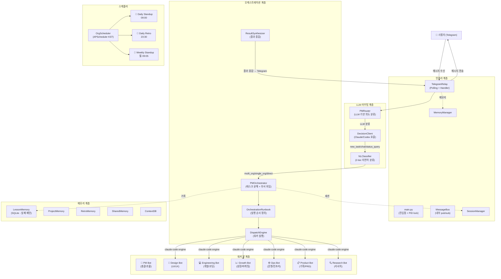
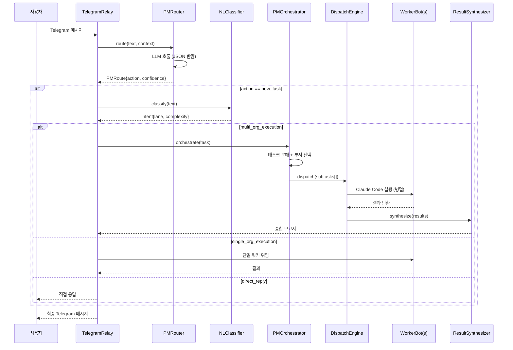
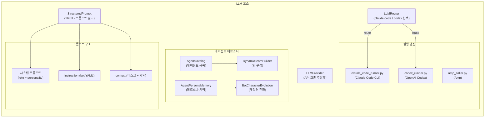
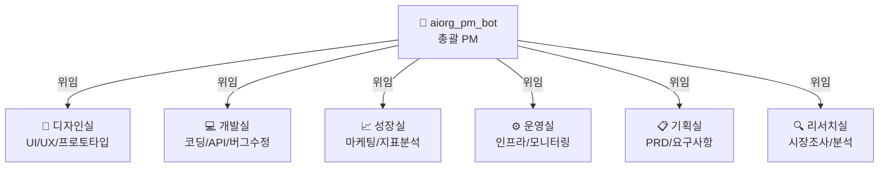

# telegram-ai-org 아키텍처 설계 문서

> 생성일: 2026-03-16 | 버전: v2

---

## 1. 시스템 개요

**telegram-ai-org**는 Telegram 그룹 채팅방을 AI 조직의 오피스로 사용하는 **멀티봇 자율 오케스트레이션** 시스템이다.

- **진입점**: Python 봇은 얇은 릴레이 역할, 실제 두뇌는 `tmux` 상주 Claude Code
- **엔진**: `claude-code` (기본) / `codex` (대안)
- **봇 수**: 7개 (PM + 6개 부서봇)
- **채널**: 단일 Telegram 그룹 채팅 (`chat_id: -5203707291`)

---

## 2. 전체 파이프라인 (Mermaid)



---

## 3. 메시지 처리 파이프라인 (상세)



---

## 4. LLM 계층 설계



---

## 5. 봇 설정 구조 (YAML 스키마)

```yaml
# bots/aiorg_*.yaml 구조
schema_version: 2
org_id: aiorg_pm_bot          # 조직 식별자
token_env: PM_BOT_TOKEN       # Telegram 토큰 환경변수
chat_id: -5203707291          # 공유 그룹 채팅 ID
engine: claude-code           # 실행 엔진
dept_name: PM                 # 부서명 (한국어)
role: 프로젝트 총괄/...        # 역할 설명
is_pm: true                   # PM 여부
team_config:
  max_team_size: 5
  guidance: "태스크 분해 후 위임"
# 캐릭터 설정 (LLM 요소)
personality: "전략적이고 체계적"
tone: "명확하고 리더십 있음"
catchphrase: "목표부터 정하자"
strengths: [프로젝트 관리, 팀 조율, 의사결정]
```

---

## 6. 메모리 계층

| 저장소 | 유형 | 목적 |
|--------|------|------|
| `LessonMemory` | SQLite (WAL) | 실패 패턴 기록 + 재발 방지 |
| `ProjectMemory` | 파일 기반 | 프로젝트 장기 기억 |
| `RetroMemory` | 파일 기반 | 회고 기록 |
| `SharedMemory` | 공유 메모리 | 봇 간 상태 공유 |
| `ContextDB` | DB | 태스크 컨텍스트 |
| `AgentPersonaMemory` | 파일 기반 | 에이전트 페르소나 발전 기록 |

---

## 7. 스케줄러 구조

```
OrgScheduler (APScheduler, KST)
├── morning_standup    → 09:00 매일
├── daily_retro        → 23:30 매일
└── weekly_standup     → 09:05 월요일
    + UserSchedule     → 사용자 정의 스케줄 (NL 파싱)
```

---

## 8. 7개 봇 조직도



---

## 9. 핵심 파일 맵

| 계층 | 파일 | 역할 |
|------|------|------|
| **인프라** | `main.py` | 진입점, PID lock |
| **인프라** | `core/telegram_relay.py` | Telegram 폴링 + 핸들러 (167KB) |
| **인프라** | `core/message_bus.py` | 내부 pub/sub |
| **LLM** | `core/pm_router.py` | LLM 기반 라우팅 |
| **LLM** | `core/nl_classifier.py` | 자연어 분류 |
| **LLM** | `core/structured_prompt.py` | 프롬프트 빌더 (16KB) |
| **LLM** | `core/llm_provider.py` | LLM API 추상화 |
| **오케스트레이션** | `core/pm_orchestrator.py` | 태스크 분해/위임 (51KB) |
| **오케스트레이션** | `core/orchestration_runbook.py` | 실행 순서 |
| **오케스트레이션** | `core/result_synthesizer.py` | 결과 종합 |
| **봇 설정** | `bots/*.yaml` | 봇 정의 + 캐릭터 |
| **메모리** | `core/lesson_memory.py` | 실패 패턴 SQLite |
| **스케줄러** | `core/scheduler.py` | APScheduler (KST) |
| **툴** | `tools/claude_code_runner.py` | Claude Code CLI |
| **툴** | `tools/codex_runner.py` | Codex CLI |
