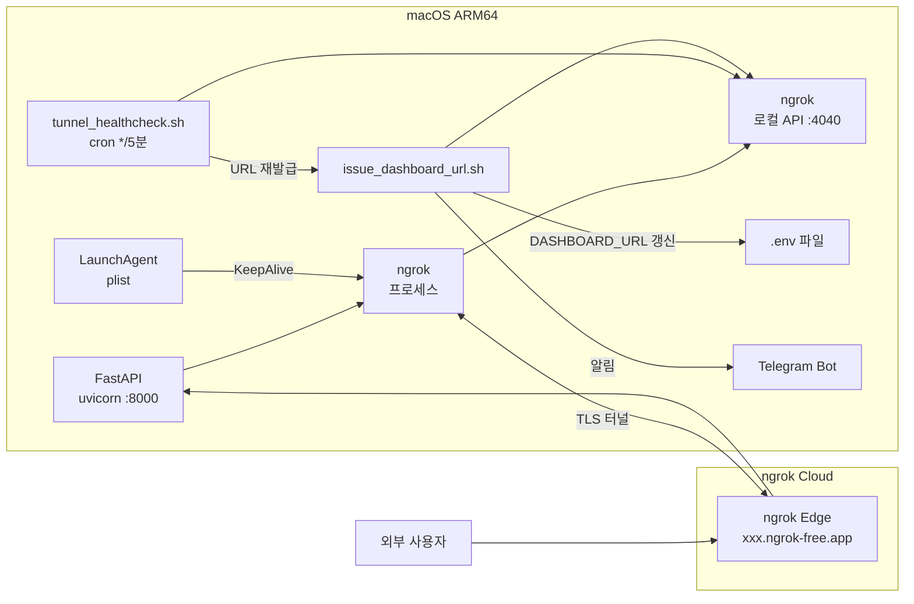

# Dashboard Tunnel 옵션 비교 분석

**작성일**: 2026-03-31
**작성자**: 운영실 인프라 에이전트
**대상**: FastAPI 대시보드 외부 노출 터널 선정

---

## 1. 현재 인프라 환경

| 항목 | 값 |
|------|-----|
| OS | macOS ARM64 (Apple Silicon, Darwin 25.4.0) |
| 서비스 포트 | 8000 (FastAPI/uvicorn) |
| 프로세스 관리 | launchd (plist) — systemd 없음 |
| 도메인 보유 | 없음 |
| 설치된 터널 도구 | 없음 (ngrok/cloudflared/nginx/caddy 미설치) |

---

## 2. 터널 옵션 비교표

| 비교 기준 | ngrok | Cloudflare Tunnel | 역방향 프록시 (nginx/caddy) |
|-----------|-------|-------------------|--------------------------|
| **보안** | TLS 자동 (HTTPS), 무료 플랜도 지원 | TLS 자동 (Zero Trust), 기업급 | TLS 수동 설정 필요 (Let's Encrypt 등) |
| **비용** | 무료 플랜: 임시 URL / 유료: 고정 도메인 | 무료 (Cloudflare 계정 필요) | 무료 (서버/도메인 비용 별도) |
| **안정성** | 무료: 세션 제한·재시작 시 URL 변경 / 유료: 고정 | 안정적 (Cloudflare 인프라 기반) | 안정적 (로컬 서버 가용성 의존) |
| **자동화 용이성** | ✅ 최우수 — 로컬 REST API (4040포트)로 현재 URL 즉시 조회 | 중간 — CLI 명령으로 조회 가능 | 낮음 — 설정 파일 수동 관리 |
| **macOS 지원** | ✅ 네이티브 지원 (brew install) | 지원 (cloudflared 바이너리) | 지원 (brew install) |
| **도메인 필요 여부** | ❌ 불필요 (임시 URL 자동 발급) | ❌ 불필요 (tunnel 자체 URL) | ✅ 필요 (도메인 없으면 IP 직접 접근) |
| **설치 복잡도** | 낮음 (brew 1줄) | 중간 (계정 + cloudflared 설정) | 높음 (설정 파일 + 인증서 관리) |
| **내부 API 자동화** | ✅ `localhost:4040/api/tunnels` JSON 응답 | 제한적 | 없음 |

---

## 3. 선정 방안: ngrok

### 선정 이유

1. **도메인 불필요**: 현재 도메인을 보유하지 않는 환경에서 즉시 사용 가능
2. **macOS 네이티브 지원**: `brew install ngrok/ngrok` 한 줄로 설치
3. **로컬 REST API 자동화**: `http://localhost:4040/api/tunnels` 를 통해 현재 public URL을 스크립트에서 즉시 조회 가능
4. **launchd 연동 용이**: plist로 백그라운드 상시 실행 가능
5. **자동화 파이프라인 적합**: URL 변경 시 `.env` 자동 갱신 + Telegram 알림 발송 패턴 구현 용이

### 무료 플랜 제한사항 및 대응

| 제한 | 대응 방안 |
|------|---------|
| 세션 재시작 시 URL 변경 | `scripts/issue_dashboard_url.sh`로 URL 자동 갱신 + `.env` DASHBOARD_URL 업데이트 |
| 월 세션 수 제한 | KeepAlive plist로 재시작 최소화 |
| 동시 터널 1개 | 포트 8000 단일 터널로 충분 |

---

## 4. 아키텍처 다이어그램

### Mermaid 다이어그램



### ASCII 다이어그램

```
┌─────────────────────────────────────────────────────┐
│  macOS ARM64                                        │
│                                                     │
│  ┌──────────────┐    ┌─────────────────────────┐   │
│  │  FastAPI     │    │  ngrok 프로세스          │   │
│  │  uvicorn     │◄───│  (LaunchAgent 관리)      │   │
│  │  :8000       │    │  로컬 API :4040          │   │
│  └──────────────┘    └───────────┬─────────────┘   │
│                                  │ TLS 터널         │
│  ┌──────────────────────────┐    │                  │
│  │  scripts/                │    │                  │
│  │  issue_dashboard_url.sh  │    │                  │
│  │  tunnel_healthcheck.sh   │    │                  │
│  └──────────┬───────────────┘    │                  │
│             │ .env 갱신           │                  │
│             ▼                    │                  │
│  ┌──────────────┐                │                  │
│  │  .env        │                │                  │
│  │  DASHBOARD_  │                │                  │
│  │  URL=https:  │                │                  │
│  └──────────────┘                │                  │
└─────────────────────────────────┼────────────────── ┘
                                  │
                    ┌─────────────▼──────────────┐
                    │  ngrok Cloud               │
                    │  https://xxx.ngrok-free.app│
                    └─────────────┬──────────────┘
                                  │
                    ┌─────────────▼──────────────┐
                    │  외부 사용자 / Telegram Bot │
                    └────────────────────────────┘
```

---

## 5. 구현 파일 목록

| 파일 | 역할 |
|------|------|
| `infra/ngrok-dashboard.plist` | macOS LaunchAgent — ngrok 상시 실행 |
| `scripts/issue_dashboard_url.sh` | URL 조회 + `.env` 갱신 + Telegram 알림 |
| `scripts/tunnel_healthcheck.sh` | 헬스체크 + 자동 복구 (cron 5분 간격) |
| `.env` (DASHBOARD_URL 항목) | 현재 활성 터널 URL 저장 |

상세 운영 절차는 `docs/dashboard-tunnel-ops-guide.md` 참조.
