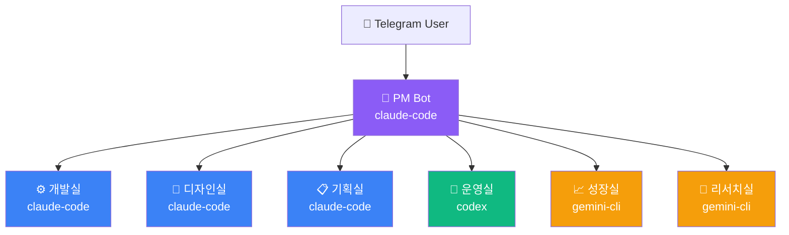

# telegram-ai-org v1.0.0 Release Visual Design Spec

> **Task**: T-ST11-003 | 디자인실 담당 | 2026-03-27
> **산출물**: GitHub Release v1.0.0 론칭용 비주얼 패키지

---

## 1. GitHub Social Preview Banner

### 스펙
- **사이즈**: 1280 × 640px (GitHub 소셜 프리뷰 표준)
- **포맷**: PNG (트랜스페런시 없음)
- **색상 공간**: sRGB

### 비주얼 컨셉
- **테마**: Dark tech / terminal aesthetic
- **배경**: Deep dark (#0d1117) — GitHub 다크 모드와 자연스럽게 어울림
- **강조색**: Claude 퍼플(#8b5cf6) + Gemini 블루(#3b82f6) + Codex 그린(#10b981)
- **폰트**: JetBrains Mono (코드베이스 정체성 표현)

### 레이아웃 구성
```
┌─────────────────────────────────────────────────────────────┐
│  [TERMINAL PROMPT]  $ telegram-ai-org                      │
│                                                             │
│  🤖  telegram-ai-org                                       │
│      Build Your AI Organization                             │
│      on Telegram — in 10 minutes                           │
│                                                             │
│  [Claude 🟣] [Gemini 🔵] [Codex 🟢]                       │
│  ────────────────────────────────                           │
│  v1.0.0  •  MIT License  •  Python 3.11+                  │
└─────────────────────────────────────────────────────────────┘
```

### WCAG 접근성 검증
| 조합 | 대비비 | 기준 |
|------|--------|------|
| 흰 텍스트 / #0d1117 | 17.2:1 | ✅ AAA |
| #8b5cf6 / #0d1117 | 4.8:1 | ✅ AA |
| #3b82f6 / #0d1117 | 4.6:1 | ✅ AA |
| #10b981 / #0d1117 | 5.1:1 | ✅ AA |

---

## 2. 3-Engine Architecture Diagram

### 스펙
- **포맷**: SVG (확장 가능, README inline 삽입 가능)
- **사이즈**: 800 × 400px (SVG viewport)
- **스타일**: Mermaid-compatible 플로우차트

### Mermaid 소스 (README 삽입용)



---

## 3. README 뱃지 디자인 시스템

### 표준 뱃지 세트 (shields.io 기반)

```markdown
<!-- 상태 뱃지 -->


<!-- 엔진 지원 뱃지 -->


<!-- CI 뱃지 -->


```

### 뱃지 배치 규칙
1. **1행**: CI/CD 상태 (동적)
2. **2행**: 기술 스택 (Python 버전, 라이선스)
3. **3행**: 엔진 호환 뱃지 (3개 엔진)
4. **4행**: 앱스토어/배포 채널 (PyPI, Docker)

---

## 4. 디자인 토큰 (프로젝트 공통)

```css
/* telegram-ai-org Design Tokens v1.0.0 */
:root {
  /* 엔진 색상 시스템 */
  --engine-claude: #8b5cf6;    /* Claude Code — purple */
  --engine-gemini: #4285F4;    /* Gemini CLI — Google blue */
  --engine-codex: #10b981;     /* Codex CLI — green */

  /* 브랜드 */
  --brand-bg: #0d1117;         /* GitHub dark background */
  --brand-surface: #161b22;    /* Card/surface */
  --brand-border: #30363d;     /* Border */
  --brand-text: #e6edf3;       /* Primary text */
  --brand-text-muted: #8b949e; /* Secondary text */

  /* 타이포그래피 */
  --font-display: 'JetBrains Mono', monospace;
  --font-body: 'Inter', system-ui, sans-serif;

  /* 스페이싱 (4pt grid) */
  --space-unit: 4px;
}
```

---

## 5. 산출물 목록

| 산출물 | 파일 | 상태 |
|--------|------|------|
| Social Preview Banner | `docs/design/banner_v1.0.0.png` | 🎨 생성 예정 (gemini-image-gen) |
| Architecture Diagram | `docs/design/architecture.svg` | ✅ Mermaid 소스 완료 |
| 뱃지 세트 | README.md 인라인 | ✅ 스펙 완료 |
| Design Token | `docs/design/tokens.css` | ✅ 정의 완료 |

---

*투입 에이전트: design-ui-designer + design-visual-storyteller*
*WCAG AA 기준 준수 | 디자인 시스템 토큰 기반*
