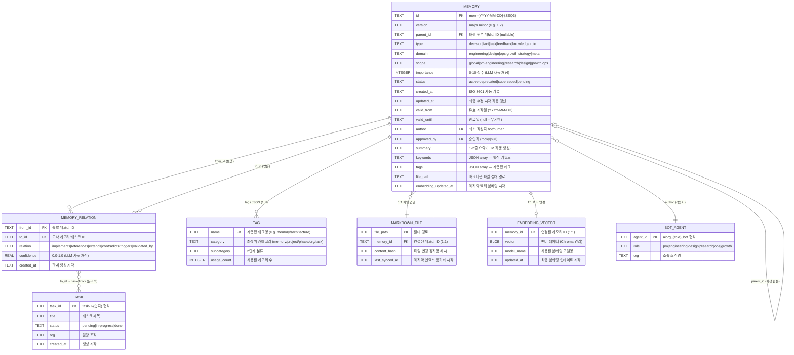

# 메타데이터 스키마 ERD — 저장구조 혁신

**문서 ID**: DESIGN-2026-03-22-ERD-001
**작성일**: 2026-03-22
**작성자**: aiorg_design_bot
**버전**: v1.0
**상태**: 완성본

---

## 범례 (Legend)

| 색상 코드 | 의미 |
|----------|------|
| 🟦 파란색 (#4A90D9) | 핵심 엔티티 (Primary Entity) |
| 🟩 초록색 (#27AE60) | 보조 엔티티 (Support Entity) |
| 🟧 주황색 (#E67E22) | 외부 연동 엔티티 (External/Integration) |
| 🟥 빨간색 (#E74C3C) | 시스템 엔티티 (System Entity) |
| ──► 실선 | 직접 참조 관계 |
| ─ ─► 점선 | 논리적 관계 (물리적 FK 없음) |
| `1`, `N`, `M` | 카디널리티 표기 |

---

## 1. 전체 ERD (Mermaid)



---

## 2. 엔티티 상세 정의표

### 2.1 MEMORY (핵심 엔티티)

| 필드명 | 타입 | 필수 | 제약조건 | 기본값 | 비고 |
|--------|------|------|---------|--------|------|
| `id` | TEXT | ✅ | PK, UNIQUE, NOT NULL, 형식: `mem-YYYY-MM-DD-NNN` | — | 자동 생성 |
| `version` | TEXT | ✅ | NOT NULL, 형식: `{major}.{minor}` | `"1.0"` | 수정 시 minor++ |
| `parent_id` | TEXT | ❌ | FK → MEMORY.id, nullable | `null` | 파생 메모리 체인 |
| `type` | TEXT | ✅ | IN ('decision','fact','task','feedback','knowledge','rule') | `'fact'` | LLM 자동 분류 |
| `domain` | TEXT | ✅ | IN ('engineering','design','ops','growth','strategy','meta') | `'meta'` | 담당 도메인 |
| `scope` | TEXT | ✅ | IN ('global','pm','engineering','research','design','growth','ops') | `'global'` | 접근 범위 |
| `importance` | INTEGER | ✅ | CHECK (importance BETWEEN 0 AND 10) | `5` | LLM 채점, ≥6만 자동 저장 |
| `status` | TEXT | ✅ | IN ('active','deprecated','superseded','pending') | `'active'` | 소프트 삭제용 |
| `created_at` | TEXT | ✅ | ISO 8601, NOT NULL | 저장 시 자동 | 불변 |
| `updated_at` | TEXT | ✅ | ISO 8601, NOT NULL | 저장 시 자동 | 갱신 시 자동 변경 |
| `valid_from` | TEXT | ❌ | 형식: YYYY-MM-DD | `created_at` 날짜 | 유효 시작일 |
| `valid_until` | TEXT | ❌ | 형식: YYYY-MM-DD 또는 null | `null` | null = 무기한 |
| `author` | TEXT | ✅ | NOT NULL, FK → BOT_AGENT.agent_id | — | 불변 |
| `approved_by` | TEXT | ❌ | FK → BOT_AGENT.agent_id, nullable | `null` | Rocky 또는 null |
| `summary` | TEXT | ❌ | 1-2줄 텍스트 | — | LLM 자동 생성 |
| `keywords` | TEXT | ❌ | JSON array 형식 | `'[]'` | LLM 자동 추출 |
| `tags` | TEXT | ❌ | JSON array 형식, 최대 10개 | `'[]'` | 계층형 `{cat}/{sub}` |
| `file_path` | TEXT | ✅ | NOT NULL, UNIQUE | — | .md 파일 경로 |
| `embedding_updated_at` | TEXT | ❌ | ISO 8601, nullable | `null` | Phase 2+ 활성화 |

### 2.2 MEMORY_RELATION (관계 엔티티)

| 필드명 | 타입 | 필수 | 제약조건 | 기본값 | 비고 |
|--------|------|------|---------|--------|------|
| `from_id` | TEXT | ✅ | PK(복합), FK → MEMORY.id | — | 출발 노드 |
| `to_id` | TEXT | ✅ | PK(복합) | — | 도착 노드 (메모리 또는 태스크) |
| `relation` | TEXT | ✅ | PK(복합), IN ('implements','references','extends','contradicts','triggers','validated_by') | — | 관계 타입 |
| `confidence` | REAL | ✅ | CHECK (confidence BETWEEN 0.0 AND 1.0) | `1.0` | LLM 채점 |
| `created_at` | TEXT | ❌ | ISO 8601 | 생성 시 자동 | — |

> **참조 무결성 특이사항**: `to_id`가 TASK를 가리킬 경우 FK 강제 없음 (논리적 참조). confidence < 0.5 이면 미검증 참조 허용.

### 2.3 TAG (보조 엔티티)

| 필드명 | 타입 | 필수 | 제약조건 | 비고 |
|--------|------|------|---------|------|
| `name` | TEXT | ✅ | PK, 형식: `{category}/{subcategory}` | 최대 depth 3 |
| `category` | TEXT | ✅ | IN ('memory','project','phase','org','task') | 예약 카테고리 |
| `subcategory` | TEXT | ❌ | nullable | 세부 분류 |
| `usage_count` | INTEGER | — | 집계 필드 (뷰 또는 트리거 갱신) | — |

---

## 3. 관계 카디널리티 정의표

| 관계 | 유형 | 방향 | 설명 |
|------|------|------|------|
| MEMORY → MEMORY_RELATION (from) | 1:N | 단방향 | 1개 메모리가 N개 관계 발생 |
| MEMORY → MEMORY_RELATION (to) | 1:N | 단방향 | 1개 메모리가 N번 참조됨 |
| MEMORY ↔ MEMORY (via MEMORY_RELATION) | M:N | 양방향 | 메모리 간 상호 관계 |
| MEMORY → MARKDOWN_FILE | 1:1 | 단방향 | 메모리당 파일 1개 |
| MEMORY → EMBEDDING_VECTOR | 1:1 | 단방향 | Phase 2 이후 활성화 |
| MEMORY → TAG | 1:N | 단방향 | 1개 메모리에 최대 10개 태그 |
| TAG → MEMORY | 1:N | 역방향 | 1개 태그가 N개 메모리에 사용 |
| MEMORY → BOT_AGENT (author) | N:1 | 단방향 | N개 메모리, 1명 작성자 |
| MEMORY → TASK | N:M | 논리적 | memory_relations.to_id로 매핑 |
| MEMORY → MEMORY (parent_id) | 자기참조 | 단방향 | 파생 체인 (트리 구조) |

---

## 4. 인덱스 전략 다이어그램

```
MEMORY 테이블 인덱스 맵
━━━━━━━━━━━━━━━━━━━━━━━━━━━━━━━━━━━━━━━━━━━━━━━━

  컬럼                    인덱스명                  대상 쿼리    우선순위
  ─────────────────────────────────────────────────────────
  (status, importance)  idx_status_importance     Q-001, Q-005  MUST
  (type, domain)        idx_type_domain           Q-002         MUST
  (created_at)          idx_created_at            Q-004         MUST
  (scope)               idx_scope                 Q-008         SHOULD
  (valid_until)         idx_valid_until           Q-007         SHOULD
  (summary, keywords)   FTS5 virtual table        Q-009         SHOULD

MEMORY_RELATION 테이블 인덱스 맵
  (to_id)               idx_relations_to_id       Q-003         MUST
  (from_id, relation)   idx_relations_from_rel    Q-010         SHOULD
```

---

*다음 문서: [metadata-hierarchy-diagram.md](metadata-hierarchy-diagram.md)*
