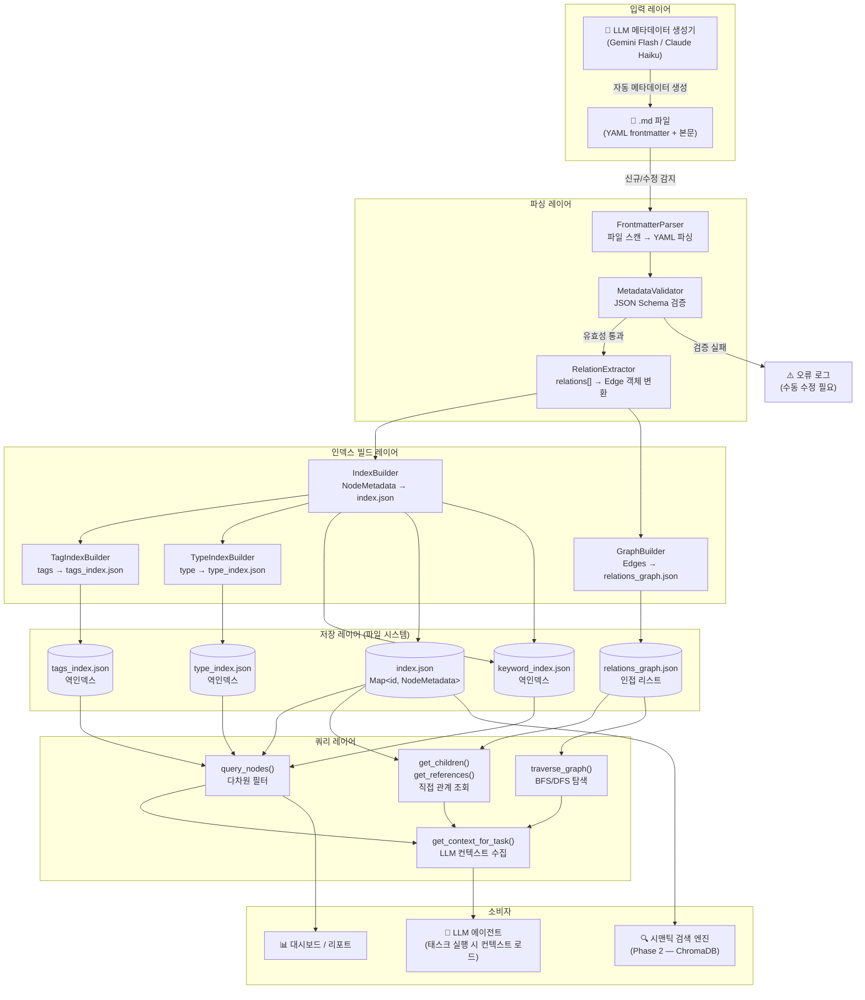

# Data Flow Diagram: 메모리 저장구조 혁신

**문서 ID**: DESIGN-DFD-2026-03-22-001
**작성일**: 2026-03-22

---

## 1. 전체 데이터 흐름 (Mermaid)



---

## 2. 저장 흐름 (ASCII — 단순화)

```
[.md 파일 변경 감지]
        │
        ▼
[FrontmatterParser]
  - python-frontmatter / gray-matter로 YAML 파싱
  - 파일별 NodeMetadata 객체 생성
        │
        ├─ 파싱 실패 ──► [오류 로그] ──► 수동 수정
        │
        ▼
[MetadataValidator]
  - JSON Schema 검증 (metadata_schema.json 기준)
  - id 포맷, required 필드 체크
        │
        ├─ 검증 실패 ──► [오류 로그] + [frontmatter 자동 보완 시도]
        │
        ▼
[RelationExtractor]
  - relations[] 배열에서 RelationEdge 객체 생성
  - edge_id = hash(source_id + target_id + relation_type)
        │
        ▼
[IndexBuilder / GraphBuilder]
  - NodeMetadata → index.json 갱신
  - RelationEdge → relations_graph.json 갱신
  - tags, type → 역인덱스 갱신
        │
        ▼
[인덱스 파일 저장 (atomic write)]
  index.json / relations_graph.json / tags_index.json
  - tmp 파일에 먼저 쓰고 atomic rename으로 교체
  - 부분 쓰기로 인한 corruption 방지
```

---

## 3. 조회 흐름 (LLM 태스크 실행 시)

```
[에이전트: 태스크 T-273 실행 요청]
        │
        ▼
[ContextLoader.get_context_for_task("TASK-T273")]
        │
        ├── [index.json 로드] ──► NodeMetadata 캐시
        │
        ├── [relations_graph.json 로드] ──► 그래프 캐시
        │
        ├── get_children(T273, ["implements","references"])
        │       └── PRD, 스펙 문서 반환
        │
        ├── get_children(T273, ["triggers"])
        │       └── 연관 retro, 결정 문서 반환
        │
        └── query_nodes(tags=T273.tags, importance=["CORE","HIGH"])
                └── 도메인 관련 핵심 메모리 반환
        │
        ▼
[상위 max_nodes 개 선별 (우선순위 + 강도 기반)]
        │
        ▼
[각 노드의 file_path로 .md 본문 lazy load]
        │
        ▼
[LLM 컨텍스트 창에 주입]
```

---

## 4. LLM 메타데이터 자동 생성 흐름

```
[새 .md 파일 저장 (frontmatter 없음)]
        │
        ▼
[MetadataGenerationHook 트리거]
  - 파일 본문 읽기
  - Gemini Flash / Claude Haiku 호출
  - 프롬프트: "아래 문서에 대한 메타데이터를 JSON으로 생성해줘.
               필드: type, importance, tags, summary, keywords, relations"
        │
        ▼
[LLM 응답 파싱 및 검증]
  - meta_confidence 점수 포함
  - 기준 이하(< 0.6) 시 임시 DRAFT 상태로 저장
        │
        ▼
[.md 파일 frontmatter prepend]
  - atomic write (원본 본문 보존)
        │
        ▼
[정상 인덱싱 흐름 진입]
```
